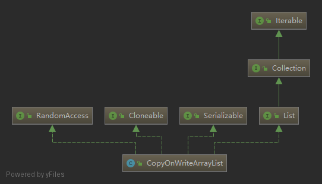

# java.util.concurrent.CopyOnArrayList

## 一、简介

**CopyOnWriteArrayList 是 ArrayList 的线程安全版本，内部也是通过数组实现，每次对数组的修改都完全拷贝一份新的数组来修改，修改完了再替换掉老数组，这样保证了只阻塞写操作，不阻塞读操作，实现读写分离**。

## 二、继承体系



CopyOnWriteArrayList实现了List, RandomAccess, Cloneable, java.io.Serializable等接口。

CopyOnWriteArrayList实现了List，提供了基础的添加、删除、遍历等操作。

CopyOnWriteArrayList实现了RandomAccess，提供了随机访问的能力。

CopyOnWriteArrayList实现了Cloneable，可以被克隆。

CopyOnWriteArrayList实现了Serializable，可以被序列化。

## 三、源码解析

### （一）属性

```java
/** 用于修改时加锁 */
final transient ReentrantLock lock = new ReentrantLock();

/** 真正存储元素的地方，只能通过getArray()/setArray()访问 */
private transient volatile Object[] array;
```

- lock：用于修改时加锁，使用 transient 修饰表示不自动序列化。
- array：真正存储元素的地方，使用 transient 修饰表示不自动序列化，使用 volatile 修饰表示一个线程对这个字段的修改另外一个线程立即可见。

问题：为啥没有size字段？且听后续分解。

### 2.CopyOnWriteArrayList() 构造方法

创建空数组。

```java
final void setArray(Object[] a) {
    array = a;
}

/**
     * 创建一个空数组
     */
public CopyOnWriteArrayList() {
    // 所有对 array 的操作都是通过 setArray() 和 getArray() 进行
    setArray(new Object[0]);
}
```

### 2.CopyOnWriteArrayList(Collection c)构造方法

- 如果 c 是 CopyOnWriteArrayList 类型，直接把它的数组赋值给当前 list 的数组，注意**这里是浅拷贝，两个集合共用同一个数组。**

- 如果 c 不是 CopyOnWriteArrayList 类型，则进行拷贝把 c 的元素全部拷贝到当前 list 的数组中。

```java
public CopyOnWriteArrayList(Collection<? extends E> c) {
    Object[] elements;
    // 如果 c 也是 CopyOnWriteArrayList 类型，那么直接把它的数组拿过来使用
    if (c.getClass() == CopyOnWriteArrayList.class)
        elements = ((CopyOnWriteArrayList<?>)c).getArray();
    else {
        // 否则调用其 toArray() 方法将集合元素转化为数组
        elements = c.toArray();
        // 同样这里 c.toArray() 返回的不一定是 Object[] 类型，详细原因见 ArrayList 里面的分析
        if (elements.getClass() != Object[].class)
            elements = Arrays.copyOf(elements, elements.length, Object[].class);
    }
    setArray(elements);
}
```

### 3.CopyOnWriteArrayList(E[] toCopyIn)构造方法

把 toCopyIn 的元素拷贝给当前 list 的数组。

```java
 public CopyOnWriteArrayList(E[] toCopyIn) {
        setArray(Arrays.copyOf(toCopyIn, toCopyIn.length, Object[].class));
    }
```

### 4.add(E e)方法

添加一个元素到末尾。

```java
/**
     * 在列表末尾添加指定元素
     *
     * @param e 需要添加的元素
     * @return {@code true} (as specified by {@link Collection#add})
     */
public boolean add(E e) {
    final ReentrantLock lock = this.lock;
    // 加锁
    lock.lock();
    try {
        // 获取旧数组，只能通过 getArray() 来操作
        Object[] elements = getArray();
        int len = elements.length;
        // 将旧数组元素拷贝到新数组中，新数组大小是旧数组大小加1
        Object[] newElements = Arrays.copyOf(elements, len + 1);
        // 将元素放在最后一位
        newElements[len] = e;
        setArray(newElements);
        return true;
    } finally {
        // 最后释放掉锁
        lock.unlock();
    }
}
```

- 加锁；

- 获取元素数组；

- 新建一个数组，大小为原数组长度加1，并把原数组元素拷贝到新数组；

- 把新添加的元素放到新数组的末尾；

- 把新数组赋值给当前对象的 array 属性，覆盖原数组；

- 解锁；

### 5.add(int index, E element)方法

添加一个元素在指定索引处。

```java
public void add(int index, E element) {
    final ReentrantLock lock = this.lock;
    // 首先仍然要加锁
    lock.lock();
    try {
        // 获取原数组
        Object[] elements = getArray();
        int len = elements.length;
        // 判断下标 index 是否越界，但是可以等于 len
        if (index > len || index < 0)
            throw new IndexOutOfBoundsException("Index: " + index +
                                                ", Size: " + len);
        Object[] newElements;
        int numMoved = len - index;

        if (numMoved == 0)
            // numMoved 如果为 0 即表示插入的是最后一位，那么拷贝一个 n+1 的数组, 其中前 n 个元素与旧数组一致
            newElements = Arrays.copyOf(elements, len + 1);
        else {
            // 如果插入的位置不是最后一位，那么新建一个长度为 n+1 的数组
            newElements = new Object[len + 1];
            // 拷贝旧数组前index的元素到新数组中
            System.arraycopy(elements, 0, newElements, 0, index);
            // 将index及其之后的元素往后挪一位拷贝到新数组中,这样正好index位置是空出来的
            System.arraycopy(elements, index, newElements, index + 1,
                             numMoved);
        }
        // 放入该元素
        newElements[index] = element;
        setArray(newElements);
    } finally {
        // 释放锁
        lock.unlock();
    }
}
```

- 加锁；

- 检查索引是否合法，如果不合法抛出IndexOutOfBoundsException异常，注意这里index等于len也是合法的；

- 如果索引等于数组长度（也就是数组最后一位再加1），那就拷贝一个len+1的数组；

- 如果索引不等于数组长度，那就新建一个len+1的数组，并按索引位置分成两部分，索引之前（不包含）的部分拷贝到新数组索引之前（不包含）的部分，索引之后（包含）的位置拷贝到新数组索引之后（不包含）的位置，索引所在位置留空；

- 把索引位置赋值为待添加的元素；

- 把新数组赋值给当前对象的array属性，覆盖原数组；

- 解锁；

### 6.addIfAbsent(E e)方法

​	添加一个元素如果这个元素不存在于集合中。

```java
/**
     * 添加一个元素如果这个元素不存在于集合中
     *
     * @param e element to be added to this list, if absent
     * @return {@code true} if the element was added
     */
public boolean addIfAbsent(E e) {
    // 获取元素数组, 取名为快照
    Object[] snapshot = getArray();
    // 检查如果元素存在,直接返回 false，如果存在再调用 addIfAbsent() 方法添加元素
    return indexOf(e, snapshot, 0, snapshot.length) >= 0 ? false :
    addIfAbsent(e, snapshot);
}

/**
     * A version of addIfAbsent using the strong hint that given
     * recent snapshot does not contain e.
     */
private boolean addIfAbsent(E e, Object[] snapshot) {
    final ReentrantLock lock = this.lock;
    // 加锁
    lock.lock();
    try {
        // 重新获取旧数组
        Object[] current = getArray();
        // 如果快照与刚获取的数组不一致，说明有修改
        int len = current.length;
        if (snapshot != current) {
            // 重新检查元素是否在刚获取的数组里
            int common = Math.min(snapshot.length, len);
            for (int i = 0; i < common; i++)
                // 到这个方法里面了, 说明元素不在快照里面
                if (current[i] != snapshot[i] && eq(e, current[i]))
                    return false;
            if (indexOf(e, current, common, len) >= 0)
                return false;
        }
        // 拷贝一份 n + 1 的数组
        Object[] newElements = Arrays.copyOf(current, len + 1);
        // 将元素放在最后一位
        newElements[len] = e;
        setArray(newElements);
        return true;
    } finally {
        // 释放锁
        lock.unlock();
    }
}
```

- 检查这个元素是否存在于数组快照中；

- 如果存在直接返回 false，如果不存在调用 addIfAbsent(E e, Object[] snapshot) 处理;

- 加锁；

- 如果当前数组不等于传入的快照，说明有修改，检查待添加的元素是否存在于当前数组中，如果存在直接返回false;

- 拷贝一个新数组，长度等于原数组长度加1，并把原数组元素拷贝到新数组中；

- 把新元素添加到数组最后一位；

- 把新数组赋值给当前对象的 array 属性，覆盖原数组；

- 解锁；

### 7.get(int index)

获取指定索引的元素，支持随机访问，时间复杂度为O(1)。

```java

/**
     * {@inheritDoc}
     *
     * @throws IndexOutOfBoundsException {@inheritDoc}
     */
public E get(int index) {
    // 获取元素不需要加锁，直接返回 index 位置的元素，这里是没有做越界检查的, 因为数组本身会做越界检查
    return get(getArray(), index);
}

@SuppressWarnings("unchecked")
private E get(Object[] a, int index) {
    return (E) a[index];
}

final Object[] getArray() {
    return array;
}

```

- 获取元素数组；

- 返回数组指定索引位置的元素；

### 8.remove(int index)方法

删除指定索引位置的元素。

```java
public E remove(int index) {
    final ReentrantLock lock = this.lock;
    // 加锁
    lock.lock();
    try {
        // 获取旧数组
        Object[] elements = getArray();
        int len = elements.length;
        E oldValue = get(elements, index);
        int numMoved = len - index - 1;
        // 如果移除的是最后一位，那么直接拷贝一份 n - 1 的新数组, 最后一位就自动删除了
        if (numMoved == 0)
            setArray(Arrays.copyOf(elements, len - 1));
        else {
            // 如果移除的不是最后一位，那么新建一个 n - 1 的新数组
            Object[] newElements = new Object[len - 1];
            // 将前 index 的元素拷贝到新数组中
            System.arraycopy(elements, 0, newElements, 0, index);
            // 将 index 后面(不包含)的元素往前挪一位，这样正好把 index 位置覆盖掉了, 相当于删除了
            System.arraycopy(elements, index + 1, newElements, index,
                             numMoved);
            setArray(newElements);
        }
        return oldValue;
    } finally {
        // 释放锁
        lock.unlock();
    }
}
```

- 加锁；

- 获取指定索引位置元素的旧值；

- 如果移除的是最后一位元素，则把原数组的前 len-1个元素拷贝到新数组中，并把新数组赋值给当前对象的数组属性；

- 如果移除的不是最后一位元素，则新建一个 len-1 长度的数组，并把原数组除了指定索引位置的元素全部拷贝到新数组中，并把新数组赋值给当前对象的数组属性；

- 解锁并返回旧值；

### 9.size()方法

返回数组的长度。

```java
public int size() {
    // 获取元素个数不需要加锁，直接返回数组的长度
    return getArray().length;
}
```

## 四、总结

- CopyOnWriteArrayList 使用 ReentrantLock 重入锁加锁，保证线程安全；

- CopyOnWriteArrayList 的写操作都要先拷贝一份新数组，在新数组中做修改，修改完了再用新数组替换老数组，所以空间复杂度是O(n)，性能比较低下；

- CopyOnWriteArrayList 的读操作支持随机访问，时间复杂度为O(1)；

- CopyOnWriteArrayList 采用读写分离的思想，读操作不加锁，写操作加锁，且写操作占用较大内存空间，所以适用于读多写少的场合；

- CopyOnWriteArrayList 只保证最终一致性，不保证实时一致性；

## 彩蛋

为什么CopyOnWriteArrayList没有size属性？

**因为每次修改都是拷贝一份正好可以存储目标个数元素的数组，所以不需要size属性了，数组的长度就是集合的大小，而不像 ArrayList 数组的长度实际是要大于集合的大小的**。

比如，add(E e)操作，先拷贝一份n+1个元素的数组，再把新元素放到新数组的最后一位，这时新数组的长度为len+1了，也就是集合的size了。