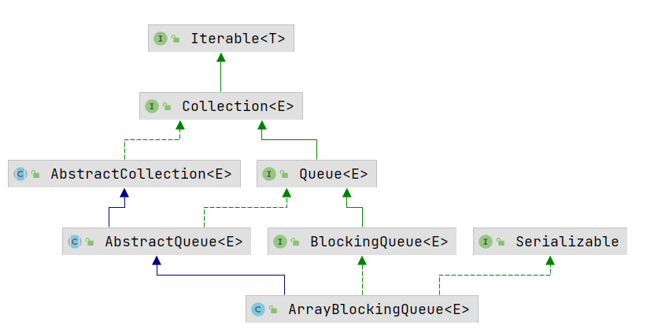
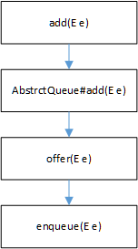

## java.util.concurrent.ArrayBlockingQueue 简介

[TOC]

## 一、结构分析

ArrayBlockingQueue 是 java 并发包下一个以数组实现的阻塞队列，它是线程安全的。而队列是一种线性表，是 FIFO（先进先出）。



## 一、源码分析

### （一）主要属性

```java
// 使用数组存储元素
final Object[] items;

// 取元素的指针（下一个 take/poll/peek/remove 的元素地址）
int takeIndex;

// 放元素的指针（下一个 put/offer/add 的元素地址）
int putIndex;

// 队列中元素数量
int count;

// 保证并发访问的可重入锁
final ReentrantLock lock;

// 非空条件（等待拿取的 Condition）
private final Condition notEmpty;

// 非满条件（等待放置的 Condition）
private final Condition notFull;
```

### （二）主要构造方法

```java
// 构建指定容量的队列，并采用默认访问策略（非公平锁）
public ArrayBlockingQueue(int capacity) {
    this(capacity, false);
}

// 可以指定容量和重入锁的公平性
public ArrayBlockingQueue(int capacity, boolean fair) {
    if (capacity <= 0)
        throw new IllegalArgumentException();
    // 初始化数组
    this.items = new Object[capacity];
    // 创建重入锁及两个条件
    lock = new ReentrantLock(fair);
    notEmpty = lock.newCondition();
    notFull =  lock.newCondition();
}

// 同上，但是初始化包括给定集合中的元素，并且按集合迭代器的遍历顺序添加。
public ArrayBlockingQueue(int capacity, boolean fair,
							  Collection<? extends E> c) {
		this(capacity, fair);

        // 初始化时候加锁保证线程安全
		final ReentrantLock lock = this.lock;
		lock.lock(); // Lock only for visibility, not mutual exclusion
		try {
			int i = 0;
			try {
				for (E e : c) {
					checkNotNull(e);
					items[i++] = e;
				}
			} catch (ArrayIndexOutOfBoundsException ex) {
				throw new IllegalArgumentException();
			}
			count = i;
			putIndex = (i == capacity) ? 0 : i;
		} finally {
			lock.unlock();
		}
	}
```

### （三）入队

入队有四个方法，它们分别是  `add(E e)`、`offer(E e)`、`put(E e)`、`offer(E e, long timeout, TimeUnit unit)`。



```java
// 在队列末尾添加元素，如果元素为空则抛出 NPE，如果队列满了抛出 IllegalStateException
public boolean add(E e) {
    // 调用父类的 add(e) 方法
    return super.add(e);
}

// super.add(e)
public boolean add(E e) {
    // 调用 offer(e) 如果成功返回 true，如果失败抛出异常
    if (offer(e))
        return true;
    else
        throw new IllegalStateException("Queue full");
}

public boolean offer(E e) {
    // 元素不可为空，如果为空则抛出 NPE
    checkNotNull(e);
    final ReentrantLock lock = this.lock;
    // 加锁
    lock.lock();
    try {
        if (count == items.length)
            // 如果数组满了就返回 false
            return false;
        else {
            // 如果数组没满就调用入队方法并返回 true
            enqueue(e);
            return true;
        }
    } finally {
        // 解锁
        lock.unlock();
    }
}

// 真正的元素入队操作，循环使用数组来放置元素
private void enqueue(E x) {
    final Object[] items = this.items;
    // 把元素直接放在放指针的位置上
    items[putIndex] = x;
    // 如果放指针到数组尽头了，就返回头部
    if (++putIndex == items.length)
        putIndex = 0;
    // 数量加 1
    count++;
    // 唤醒 notEmpty，因为入队了一个元素，所以肯定不为空了
    notEmpty.signal();
}


// 在队尾插入指定元素，如果队列满了则等待空间变得可用
public void put(E e) throws InterruptedException {
    checkNotNull(e);
    final ReentrantLock lock = this.lock;
    // 加锁，如果线程中断了抛出异常
    lock.lockInterruptibly();
    try {
        // 如果数组满了，使用 notFull 等待，notFull 等待的意思是说现在队列满了，只有取走一个元素后，队列才不满，然后唤醒notFull，然后继续现在的逻辑。这里之所以使用 while 而不是 if，是因为有可能多个线程阻塞在 lock 上，即使唤醒了可能其它线程先一步修改了队列又变成满的了，这时候需要再次等待。
        while (count == items.length)
            notFull.await();
        // 入队
        enqueue(e);
    } finally {
        // 解锁
        lock.unlock();
    }
}


public boolean offer(E e, long timeout, TimeUnit unit)
    throws InterruptedException {
    checkNotNull(e);
    long nanos = unit.toNanos(timeout);
    final ReentrantLock lock = this.lock;
    // 加锁
    lock.lockInterruptibly();
    try {
        // 如果数组满了，就阻塞 nanos 纳秒
        // 如果唤醒这个线程时依然没有空间且时间到了就返回 false
        while (count == items.length) {
            if (nanos <= 0)
                return false;
            nanos = notFull.awaitNanos(nanos);
        }
        // 入队
        enqueue(e);
        return true;
    } finally {
        // 解锁
        lock.unlock();
    }
}
```

**当队列满了的话**：

`add(e)` 会直接抛出 IllegalStateException 异常，而 `offer(e)` 则是返回 false，`put(e)`则使用 notFull 进行等待，`offer(e, timeout, unit)` 则会等待一段时间后如果队列依然是满的就返回 false。

### （四）出队

出队有四个方法，分别是 remove()、poll()、take()、poll(long timeout, TimeUnit unit)。

```java
public E remove() {
    // 调用 poll() 方法出队
    E x = poll();
    if (x != null)
        // 如果有元素出队就返回这个元素
        return x;
    else
        // 如果没有元素出队就抛出异常（队列为空的时候）
        throw new NoSuchElementException();
}

public E poll() {
    final ReentrantLock lock = this.lock;
    // 加锁
    lock.lock();
    try {
        // 如果队列没有元素则返回null，否则出队
        return (count == 0) ? null : dequeue();
    } finally {
        lock.unlock();
    }
}

// 出队操作
private E dequeue() {
    final Object[] items = this.items;
    @SuppressWarnings("unchecked")
    // 取取指针位置的元素
    E x = (E) items[takeIndex];
    // 把取指针位置设为null
    items[takeIndex] = null;
    // 取指针前移，如果数组到头了就返回数组前端循环利用
    if (++takeIndex == items.length)
        takeIndex = 0;
    // 元素数量减1
    count--;
    if (itrs != null)
        itrs.elementDequeued();
    // 唤醒notFull条件
    notFull.signal();
    return x;
}


public E take() throws InterruptedException {
    final ReentrantLock lock = this.lock;
    // 加锁
    lock.lockInterruptibly();
    try {
        // 如果队列无元素，则阻塞等待在条件notEmpty上
        while (count == 0)
            notEmpty.await();
        // 有元素了再出队
        return dequeue();
    } finally {
        // 解锁
        lock.unlock();
    }
}

public E poll(long timeout, TimeUnit unit) throws InterruptedException {
    long nanos = unit.toNanos(timeout);
    final ReentrantLock lock = this.lock;
    // 加锁
    lock.lockInterruptibly();
    try {
        // 如果队列无元素，则阻塞等待nanos纳秒
        // 如果下一次这个线程获得了锁但队列依然无元素且已超时就返回null
        while (count == 0) {
            if (nanos <= 0)
                return null;
            nanos = notEmpty.awaitNanos(nanos);
        }
        return dequeue();
    } finally {
        lock.unlock();
    }
}


```

**如果队列为空的时候**：

`remove()`会抛出异常，`poll()` 则返回 null，`take()`则阻塞等待在条件 notEmpty 上，`poll(timeout, unit)`则阻塞等待一段时间后如果还为空就返回null；

## 总结

（1）ArrayBlockingQueue不需要扩容，因为是初始化时指定容量，并循环利用数组；

（2）ArrayBlockingQueue利用takeIndex和putIndex循环利用数组；

（3）入队和出队各定义了四组方法为满足不同的用途；

（4）利用重入锁和两个条件保证并发安全；

## 彩蛋

（1）论BlockingQueue中的那些方法？

BlockingQueue是所有阻塞队列的顶级接口，它里面定义了一批方法，它们有什么区别呢？

操作|抛出异常|返回特定值|阻塞|超时
---|---|---|---|---
入队|add(e)|offer(e)——false|put(e)|offer(e, timeout, unit)
出队|remove()|poll()——null|take()|poll(timeout, unit)
检查|element()|peek()——null|-|-

（2）ArrayBlockingQueue有哪些缺点呢？

a）队列长度固定且必须在初始化时指定，所以使用之前一定要慎重考虑好容量；

b）如果消费速度跟不上入队速度，则会导致提供者线程一直阻塞，且越阻塞越多，非常危险；

c）只使用了一个锁来控制入队出队，效率较低，那是不是可以借助分段的思想把入队出队分裂成两个锁呢？且听下回分解。

---

